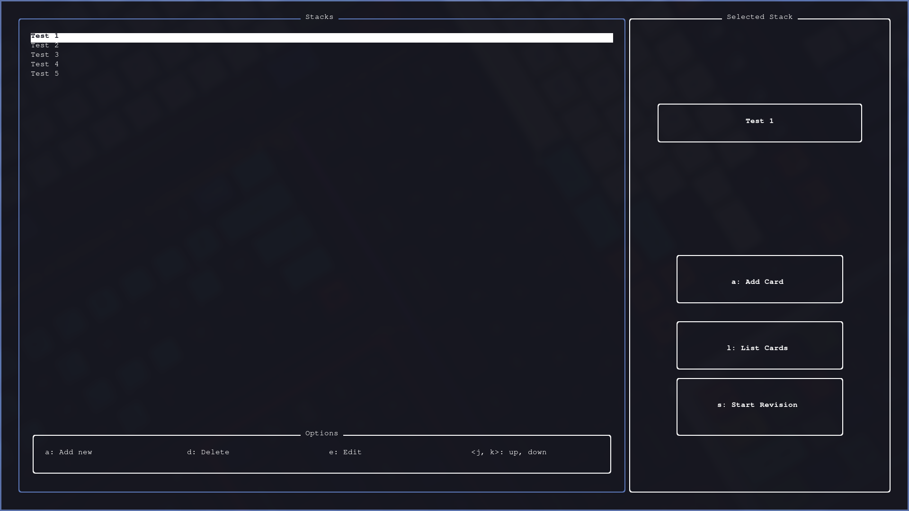
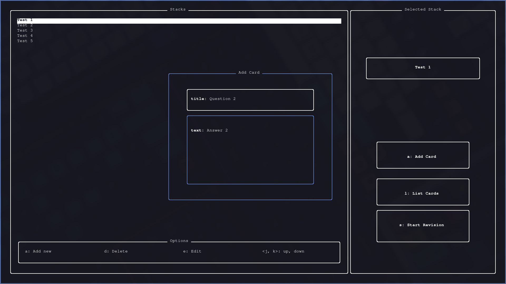
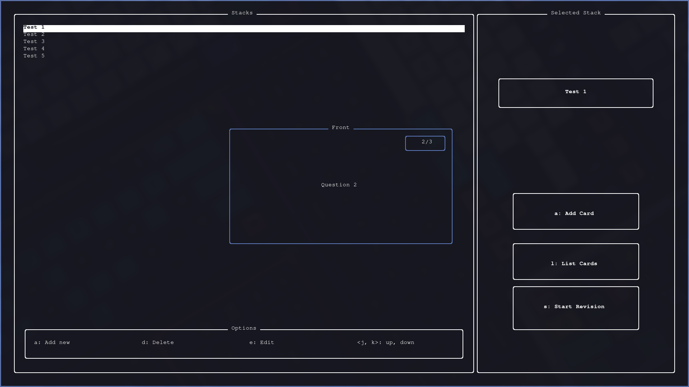

<div align="center">
	
</div>
<h1 align="center">Cards</h1>
<h5 align="center">A CLI app for revisions</h5>

## Preview

- Cards is an CLI app for revisions written in Rust.
- The revision system is based on __Stacks__ and __Cards__.
- All data is stored inside of a __database__.
<div align="center">
	</img>
</div>

---
- The Cards consist of the __Front__ and the __Back__.
- On the Front of the card there is a __question__ or a __word__.
- And on the Back of the card there is the __answer__ or a __explanation__.
<div align="center">
	</img>
</div>

---
- The revision system is going to go trough __all the cards__.
- First it will show the __Front__.
- Then it will show the __Back__.
<div align="center">
	</img>
</div>

## Install

#### Download
- Download the binary listed in release.

#### Compile
- To compile the app you need to install [rust](https://rust-lang.org).
- To clone the repo you need git.
```zsh
# Clone repo
git clone https://github.com/Vjg9/cards.rs

# Compile 
cd cards.rs/
cargo build -r
```
- The compiled code shoud be in: ./target/release

## Configuration

- Yout can configure the location of the database and the highlight color.
- You can either configure the app with the __C__ keybinding or with the config file.
- The Config file is located at __.config/cards/config.json__.

```json 
// Config file for cards.rs
{
	"db_file": ".config/cards/cards.db",
	"highlight_color": 4
}
```
